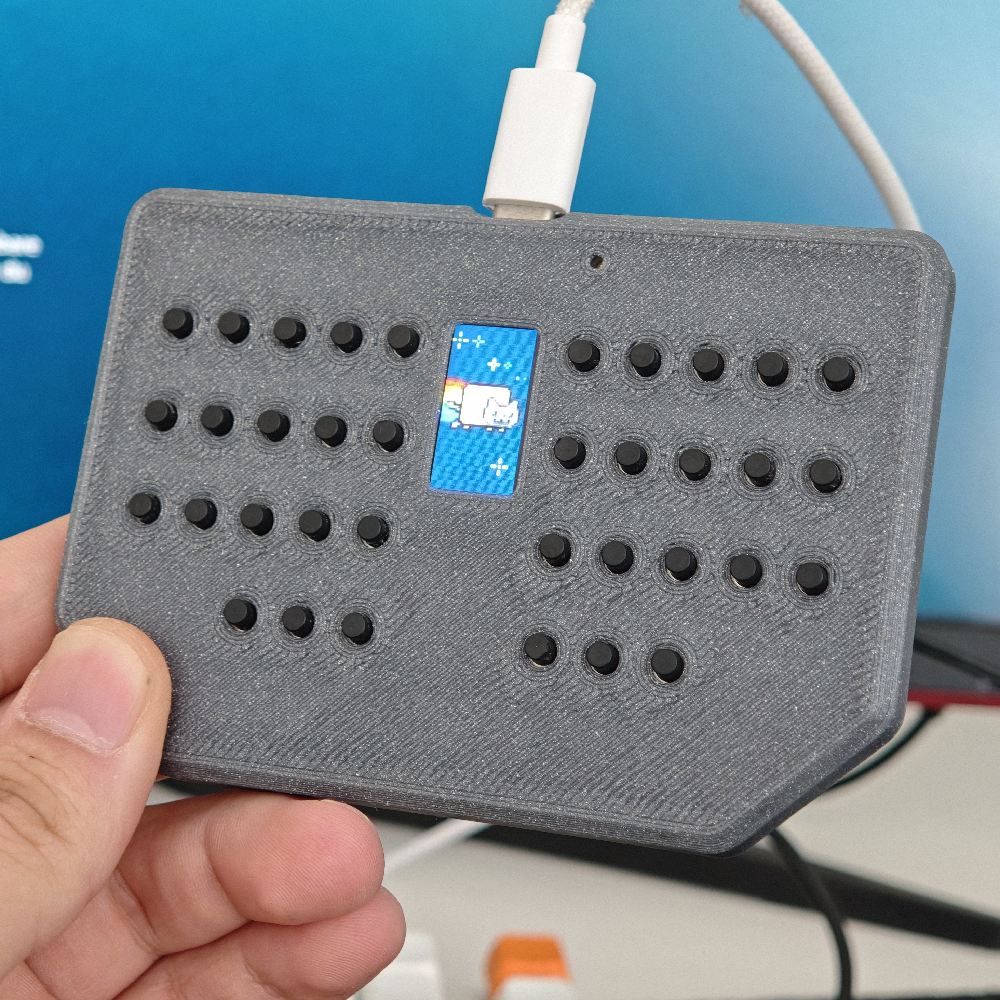
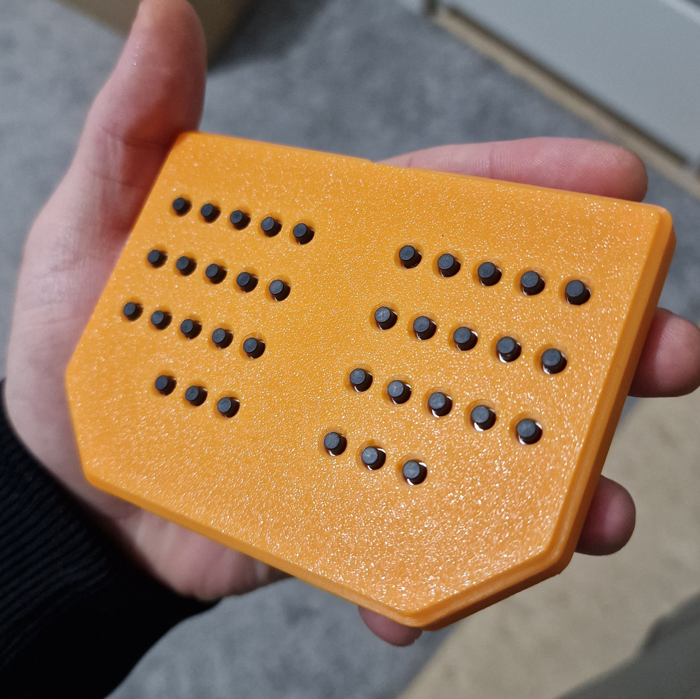

# Pocketboard

### A Pocket-Friendly On-the-Go Keyboard 🖲️

**Pocketboard** is a compact, versatile keyboard designed for IT technicians and professionals who need a portable and efficient input device.

**NOTE:** If you are building this keyboard and want to use KMK make sure to flash MicroPython for [Adafruit Feather RP2040](https://micropython.org/download/ADAFRUIT_FEATHER_RP2040/). After flashing just copy and paste the firmware located in the `firmware/kmk` folder. I recommend using the QMK firmware instead of KMK.

## Progress List:

- [x] Firmware: Home row mods!
- [x] Firmware: Layers
- [x] Firmware: LED Control (On/Off)
- [x] Hardware & Firmware: LCD!
- [x] 3D: Case Design

## Features

- **USB Type-C Connector**: Modern and reliable connection for seamless usage.
- **Miryoku Layout**: Optimized for productivity and efficient typing.
- **LEDs and Display**: Equipped with programmable LEDs and a display which shows pressed key and small animation when idle.

## What's New?

Pocketboard builds upon the original **HandiPi** design with several upgrades and enhancements:

- **ATMega328 replaced with RP2040**: Improved performance and more flexibility with the powerful RP2040 microcontroller.
- **LEDs for Illumination**: Added for better visibility.
- **USB Type-C Connector**: Ensures ease of connectivity and compatibility with modern devices.
- **LCD Support**: Added support for an LCD display for dynamic functionality. Tested and fully operational!
- **SMD Components**: Transitioned from through-hole components to SMD for a more compact design.

## Why Pocketboard?

Pocketboard is crafted for those who are often on the move, combining portability with practicality. Whether you're debugging systems or managing configurations, this handy keyboard ensures you're always prepared and comes handy to keep in your cargo pants or in your car.

## Project Structure

The project repository is structured as follows:

- **`kicad/`**: Contains PCB design files and schematics.
- **`gerbers/`**: Includes Gerber files essential for manufacturing.
- **`fimware/qmk`**: Includes Pocketboard firmware files. This folder should be copied to `qmk_firmware/keyboards`  before compiling.
- **`fimware/kmk`**: Includes Pocketboard firmware files. This folder should be copied to your keyboard after flashing MicroPython. (Not fully implemented!)

The schematic is available in PDF format in the `kicad/` directory.

## Credits

Pocketboard is inspired by the **HandiPi** project by [brickbots](https://github.com/brickbots).

## Contributing

We welcome contributions from the community! If you’re interested in helping with development, please:

1. Open an issue to discuss your ideas or proposed changes.
2. After discussion, submit a pull request (PR) with your contribution.

Your feedback and suggestions are invaluable in making Pocketboard even better!
